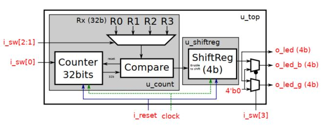
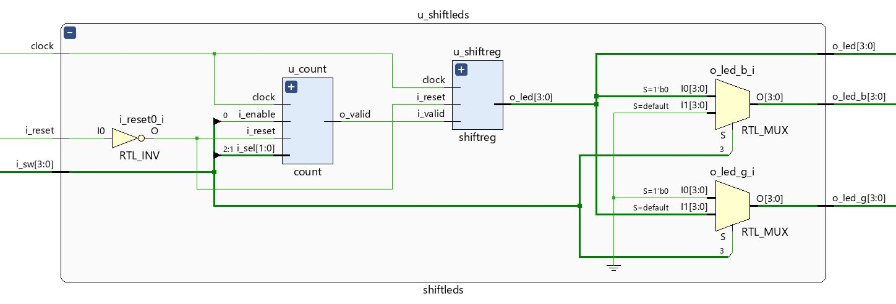
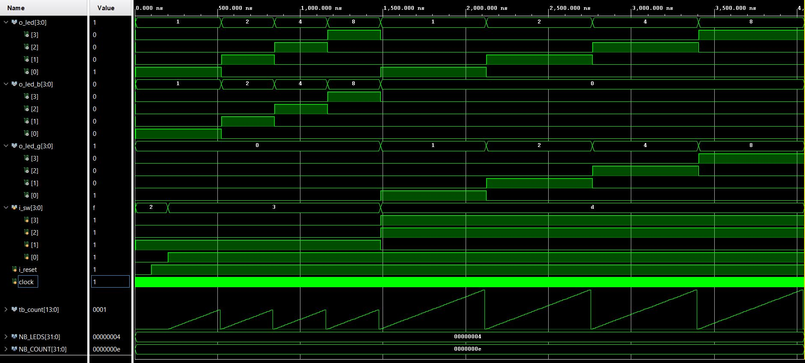
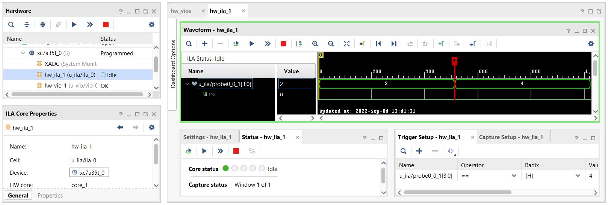

# Laboratorio 1: Proyecto LEDs

El proyecto consiste en la implementación de la arquitectura de la figura mediante el uso de Verilog.

Los nombres en rojo son puertos.
- *i_reset* es el reset del sistema, el cual pone a cero el contador e inicializa el shift register (SR).
- *i_sw[0]* controla el enable (1) del contador. En estado (0) todo se detiene sin alterar el estado actual del contador y del SR.
- El SR se desplaza únicamente cuando el contador llegó a algún límite R0-R3.
- La elección del límite se puede realizar en cualquier momento del funcionamiento mediante *i_sw[2:1]*.
- *i_sw[3]* elige el color de los LEDs RGB.

En la figura puede observarse el esquemático resultante del análisis RTL del diseño realizado.

## Simulación
En la figura se puede observar las formas de ondas resultantes de una simulación de comportamiento producida mediante el testbench diseñado.

## Implementación: Módulos VIO e ILA
Se implementan los IP cores Virtual Input/Output (VIO) e Integrated Logic Analyzer (ILA) para utilizarlos como interfaz y trabajar con el servidor remoto de FPGAs.

A continuación se observa la forma de onda obtenida con ILA ante un trigger al leer un 4 en el estado de los LEDs.

