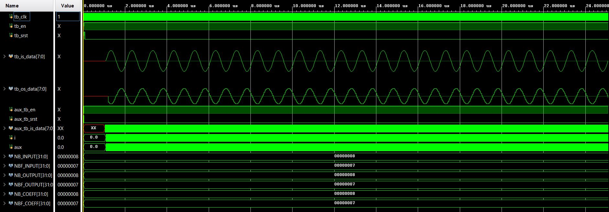
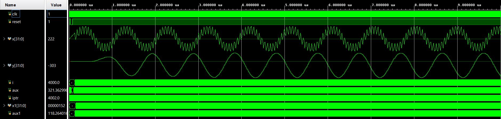
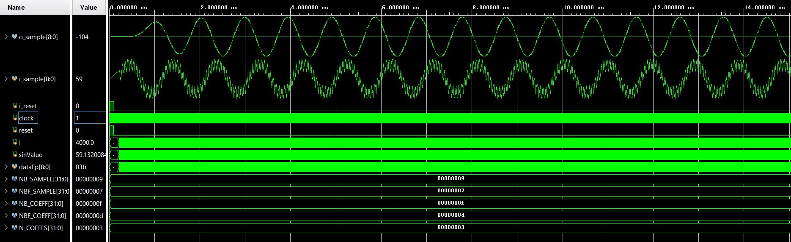
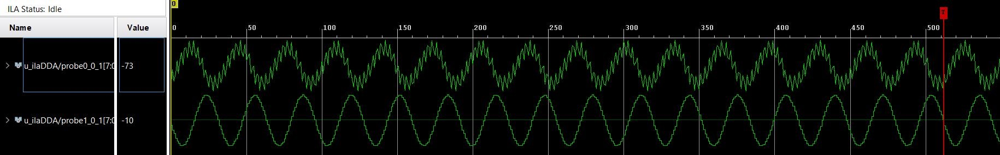
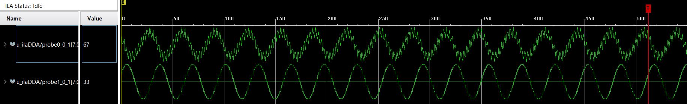
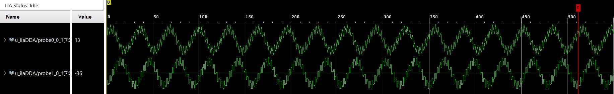

# Laboratorio 2: Implementación de filtros

## Efectos de cuantización

Ejecutar los script de python con el objetivo de comprender los efectos de cuantización de los coeficientes.

- [fir_filter_direct_form.ipynb](./python/fir_filter_direct_form.ipynb)
- [iir_filter_direct_form.ipynb](./python/iir_filter_direct_form.ipynb)
- [IIR_Filter_Design.ipynb](./python/IIR_Filter_Design.ipynb)

Instanciar y ejecutar el testbench de cada uno de los filtros.

- [filtro_fir.v](./rtl/fir/filtro_fir.v), [tb_filtro_fir.v](./rtl/fir/tb_filtro_fir.v)
- [iir.v](./rtl/iir/iir.v), [filter_tb.v](./rtl/iir/filter_tb.v)
- [iir_top.v](./rtl/iirv2/iir_top.v), [iir_filter.v](./rtl/iirv2/iir_filter.v), [coeffSec1.v](./rtl/iirv2/coeffSec1.v), [coeffSec2.v](./rtl/iirv2/coeffSec2.v), [coeffSec3.v](./rtl/iirv2/coeffSec3.v), [tb_iir_filter.v](./rtl/iirv2/tb_iir_filter.v)

Los resultados de las simulaciones son las siguientes:

**[tb_filtro_fir.v:](./rtl/fir/tb_filtro_fir.v)**

**[filter_tb.v:](./rtl/iir/filter_tb.v)**

**[tb_iir_filter.v:](./rtl/iirv2/tb_iir_filter.v)**

## Primer modelo

Implementar en FPGA el filtro FIR según los siguientes archivos:

- [top_design.v](./rtl/impl/top_design.v)
- [signal_generator.v](./rtl/impl/signal_generator.v)
- [filtro_fir.v](./rtl/impl/filtro_fir.v)
- [SatTruncFP.v](./rtl/impl/SatTruncFP.v)

Agregar los IPs VIO e ILA para controlar en forma remota el diseño.

## Laboratorio

Considerar un sistema de transmisión compuesto por una señal senoidal y un filtro pasa bajo con las siguientes características:

- Señal senoidal compuesta por dos frecuencias $f_{1} = 17 kHz$ (A = 0.5) y $f_{2} = 1.5 kHz$ (A = 1.0)
- Frecuencia de muestreo $f_{s} = 48 kHz$
- Filtro pasa bajo con frecuencia de corte $f_{cut} = 8 kHz$

Desarrollo del modelo:

1. Utilizando el script de python [coeff.ipynb](./python/coeff.ipynb), determinar los coeficientes del filtro para una frecuencia de corte de $f_{cut} = 8 kHz$. El filtro debe tener una longitud de 15 coeficientes.
2. Realizar el diagrama de bloques del filtro.
3. Generar un proyecto con los archivos entregados por la cátedra con la herramienta Vivado.
4. Configurar el archivo [mem.hex](./rtl/impl/mem.hex) con las señales senoidales especificadas previamente utilizando el script [genmem.py](./python/genmem.py).
5. Generar los coeficientes del filtro utilizando el script [coeff.ipynb](./python/coeff.ipynb) para los siguientes valores de frecuencias de corte $f_{cut} = 0.5 kHz$, $8 kHz$, $18 kHz$.
6. Configurar el filtro en Verilog con los valores de los coeficientes cuantizados (sintetizar cada filtro por separado).
7. Implementar en FPGA y graficar las señales senoidales pre y pos filtradas.

**Diagrama de bloques del filtro:**

**Formas de onda obtenido de ILA con implementación:**

Frecuencia de corte de 0.5 kHz:

Frecuencia de corte de 8 kHz:

Frecuencia de corte de 18 kHz:

